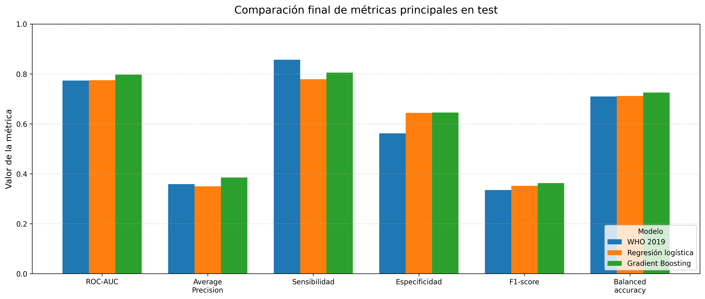
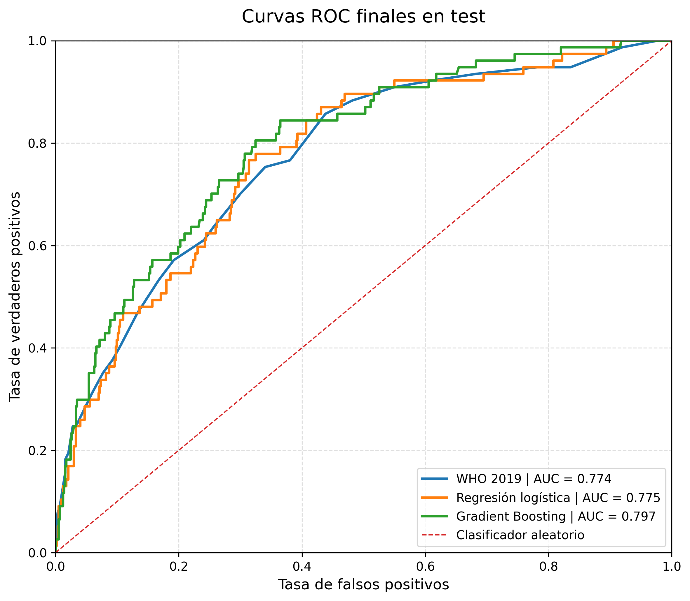
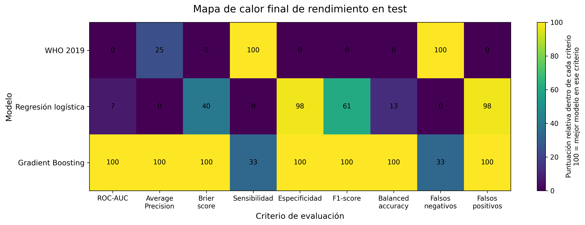

# Explainable Cardiovascular Risk Prediction

Portfolio project focused on estimating 10-year cardiovascular risk using interpretable and predictive modelling approaches.

## Project objective

The goal of this project was to compare different approaches for estimating the probability of a cardiovascular event within 10 years, combining clinical interpretability with machine learning evaluation.

The project compares:

- WHO 2019 Cardiovascular Risk Chart
- Logistic Regression
- Gradient Boosting

## Dataset and target

The final modelling dataset was split into training and test sets using a stratified approach.

| Set | Participants | Events | Prevalence |
|---|---:|---:|---:|
| Training | 2,596 | 307 | 11.83% |
| Test | 650 | 77 | 11.85% |

Target variable:

```text
EVENTO_CV_10_ANIOS
```

Main predictors used:

```text
EDAD, HOMBRE, FUMADOR_ACTUAL, PRESION_SISTOLICA, IMC
```

## Methodology

The workflow included:

1. Data preparation and cleaning
2. Exploratory data analysis
3. Construction of the final target variable
4. Model training and comparison
5. Threshold selection before final test evaluation
6. Final evaluation using classification, ranking and calibration metrics
7. Visual reporting and interpretation of results

## Final results on test set

| Model | ROC-AUC | Average Precision | Brier score | Sensitivity | F1-score | Balanced accuracy |
|---|---:|---:|---:|---:|---:|---:|
| WHO 2019 | 0.7735 | 0.3588 | 0.0930 | 0.8571 | 0.3350 | 0.7095 |
| Logistic Regression | 0.7752 | 0.3501 | 0.0912 | 0.7792 | 0.3519 | 0.7116 |
| Gradient Boosting | 0.7973 | 0.3854 | 0.0885 | 0.8052 | 0.3626 | 0.7255 |

Main conclusions:

- **Gradient Boosting** achieved the strongest overall predictive performance.
- **WHO 2019** achieved the highest sensitivity and the lowest number of false negatives.
- **Logistic Regression** offered the best balance between interpretability and global calibration.

## Key visual outputs







## Repository structure

```text
cardiovascular-risk-prediction/
├── notebooks/
│   └── cardiovascular_risk_prediction_nhefs.ipynb
├── src/
│   └── cardiovascular_risk_prediction_nhefs.py
├── reports/
│   ├── cardiovascular_risk_report.pdf
│   └── final_project_summary.md
├── outputs/
│   ├── figures/
│   ├── tables/
│   └── data/
├── models/
├── requirements.txt
└── README.md
```

## Technologies

- Python
- pandas
- NumPy
- scikit-learn
- matplotlib
- joblib
- Jupyter Notebook

## Notes

This project is intended as a portfolio project for data analysis, predictive modelling and business-oriented communication of results. It is not a medical diagnostic tool.
